# Neural Network Hyper-parameter Optimization

## Dataset
- Dataset: [Iris Dataset](https://archive.ics.uci.edu/ml/datasets/iris)

## Prerequisites
- Python 3.x
- Required Libraries
  - numpy
  - pandas
  - scikit-learn
  - matplotlib
  - tenserflow

You can install the required libraries using
 
```bash
pip install -r requirements.txt
```
## Optional
You can set up a `venv` and install the packages from the virtual environment

## How to run the code
1. Ensure that the Pre requisites are installed
2. Make you working directory point to the dir `main.py` 
3. Run the script using the following command

```bash
python main.py
```

## Output
- The script with generate a model history plots file for each combination of hyperparameters
- A table summarizing the results for different combination of hyperparameters will be printed

## Assumptions

- The script assumes the Iris dataset is used
- One-hot encoding is applied for multi-class classification

## Summary of results
The neural network was trained and evaluated using different combinations of activation functions, optimizers, and epochs. 
The results are summarized in the table below:

|   Number     | Activation| Optimizer | Loss Function            | Epochs     | Training Accuracy  | Testing Accuracy | Training Loss  | Testing Loss  |
|--------------|-----------|-----------|--------------------------|------------|--------------------|------------------|----------------|---------------|
| 0            | relu      | adam      | categorical_crossentropy | 50         | 0.891667           | 0.866667         | 0.287834       | 0.283418      |
| 1            | relu      | adam      | categorical_crossentropy | 100        | 0.958333           | 1.000000         | 0.227138       | 0.203218      |
| 2            | relu      | adam      | mean_squared_error       | 50         | 0.958333           | 0.933333         | 0.056984       | 0.055421      |
| 3            | relu      | adam      | mean_squared_error       | 100        | 0.966667           | 1.000000         | 0.038003       | 0.036220      |
| 4            | relu      | sgd       | categorical_crossentropy | 50         | 0.816667           | 0.866667         | 0.399181       | 0.397938      |
| 5            | relu      | sgd       | categorical_crossentropy | 100        | 0.966667           | 0.966667         | 0.334597       | 0.316408      |
| 6            | relu      | sgd       | mean_squared_error       | 50         | 0.783333           | 0.633333         | 0.175331       | 0.188510      |
| 7            | relu      | sgd       | mean_squared_error       | 100        | 0.733333           | 0.800000         | 0.123326       | 0.117749      |
| 8            | tanh      | adam      | categorical_crossentropy | 50         | 0.958333           | 0.966667         | 0.255715       | 0.253078      |
| 9            | tanh      | adam      | categorical_crossentropy | 100        | 0.958333           | 1.000000         | 0.207088       | 0.205845      |
| 10           | tanh      | adam      | mean_squared_error       | 50         | 0.883333           | 0.900000         | 0.067284       | 0.067126      |
| 11           | tanh      | adam      | mean_squared_error       | 100        | 0.966667           | 1.000000         | 0.017484       | 0.010669      |
| 12           | tanh      | sgd       | categorical_crossentropy | 50         | 0.916667           | 0.900000         | 0.280519       | 0.273218      |
| 13           | tanh      | sgd       | categorical_crossentropy | 100        | 0.941667           | 0.900000         | 0.270102       | 0.267448      |
| 14           | tanh      | sgd       | mean_squared_error       | 50         | 0.700000           | 0.800000         | 0.118937       | 0.122001      |
| 15           | tanh      | sgd       | mean_squared_error       | 100        | 0.933333           | 0.900000         | 0.071300       | 0.069177      |

## Plot
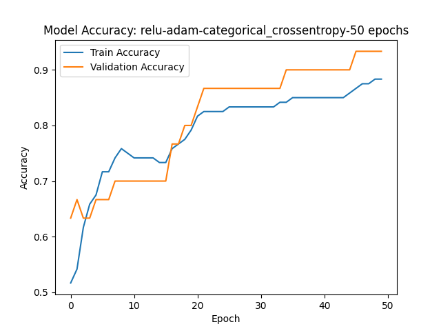 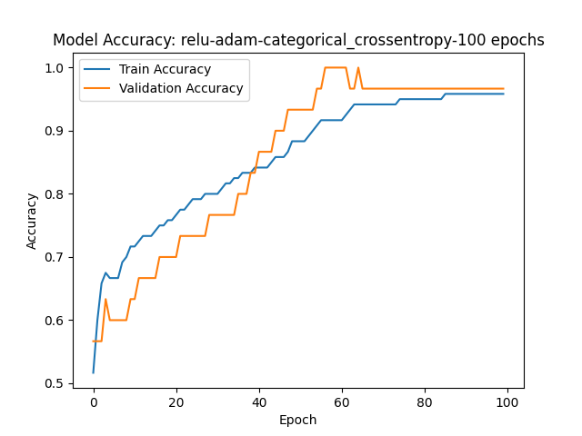
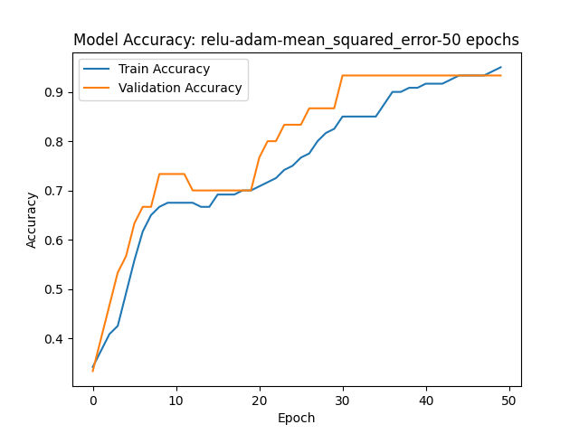 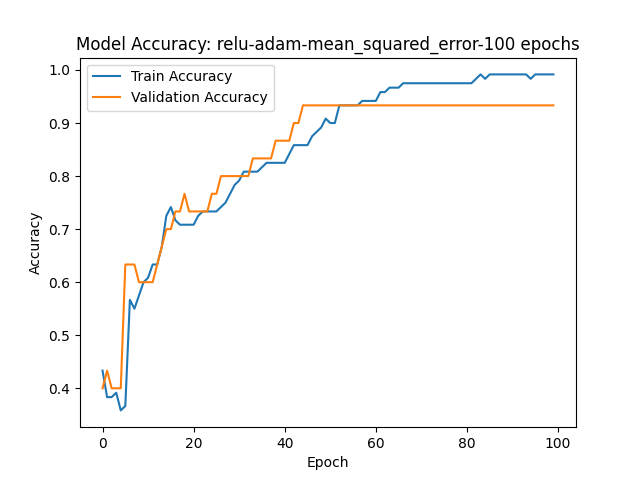

------------------------------------------------------------------------

 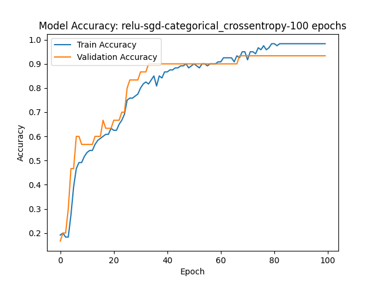
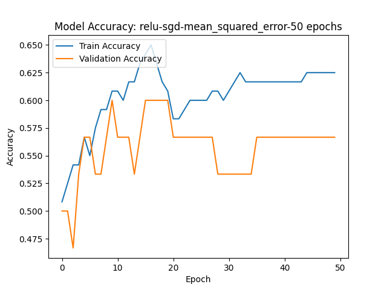 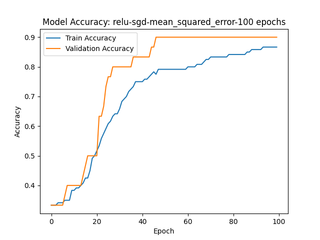

------------------------------------------------------------------------

 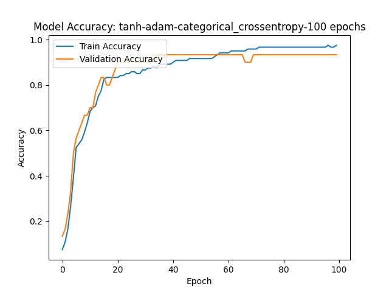
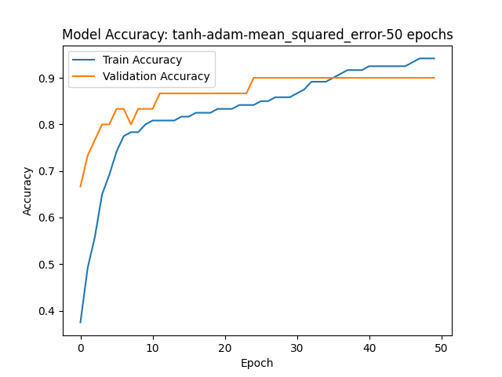 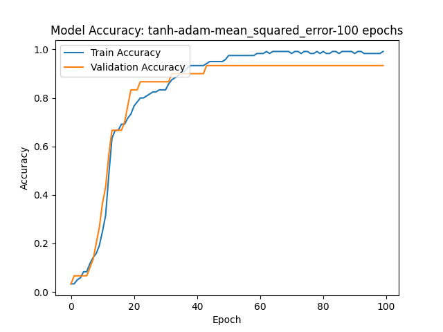

------------------------------------------------------------------------

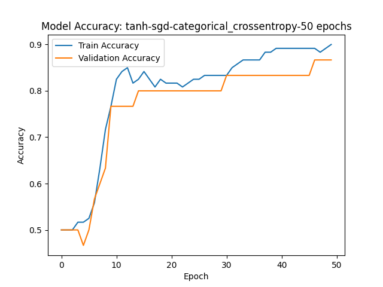 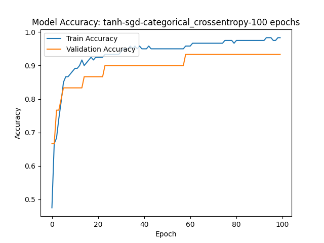
 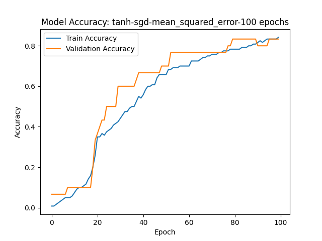


## Best Performing Model
- Activation Function: Both relu and tanh with adam optimizer and categorical_crossentropy or mean_squared_error loss function performed well.
- Optimizer: adam consistently provided better results compared to sgd.
- Loss Function: categorical_crossentropy and mean_squared_error both worked well. Despite mean_squared_error being more common for regression tasks, it performed reasonably here.
- Epochs: Increasing epochs to 100 generally improved the accuracy.

## conclusion

- Activation Functions: relu and tanh both performed well, with relu often slightly outperforming tanh. relu is known to help mitigate the vanishing gradient problem, which might explain its superior performance.
- Optimizers: The adam optimizer consistently outperformed sgd. This is likely due to adam’s adaptive learning rate and momentum.
- Loss Functions: While categorical_crossentropy is more appropriate for classification tasks, mean_squared_error also yielded competitive results. However, for proper classification tasks, categorical_crossentropy is preferred.